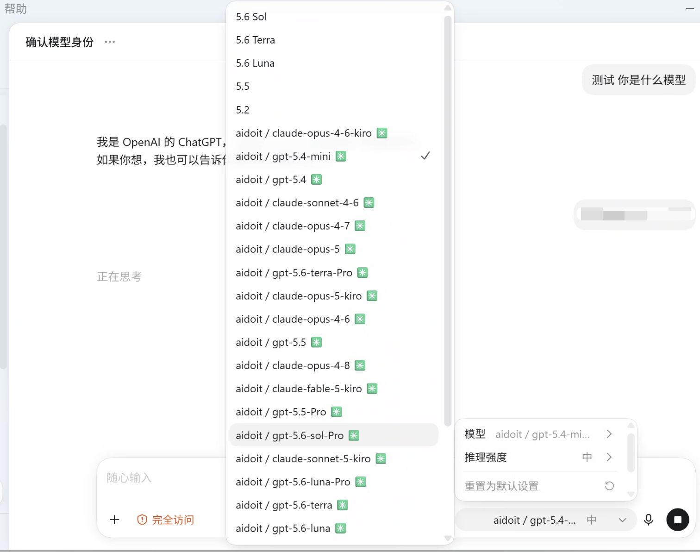
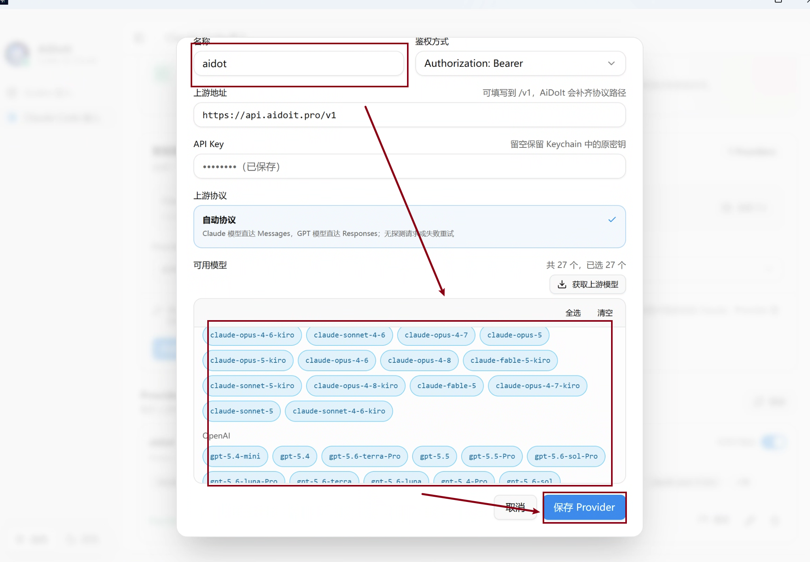

# AiDoIt 帮助中心

按平台和客户端选择对应的图文教程。

[返回项目首页](../README.md) · [下载最新版](https://github.com/AiDoIt-Platform/AiDoIt/releases/latest) · [提交问题](https://github.com/AiDoIt-Platform/AiDoIt/issues/new)

## 🧭 选择平台

| 平台 | 安装说明 | Codex | Claude |
|---|---|---|---|
| **Windows 10/11 x64** | [安装、升级、校验与卸载](./Windows/Installation/README.md) | [Codex 图文教程](./Windows/Codex/README.md) | [Claude 图文教程](./Windows/Claude/README.md) |
| **Ubuntu x64 / ARM64** | [在线安装与卸载](./Ubuntu/README.md) | [启动并测试 Codex](./Ubuntu/README.md#四启动并测试-codex) | [启动并测试 Claude Code](./Ubuntu/README.md#五启动并测试-claude-code) |
| **macOS** | 请从项目 Releases 获取对应版本 | [Codex 图文教程](./macOS/Codex/README.md) | [Claude 图文教程](./macOS/Claude/README.md) |

> [!NOTE]
> Windows 和 macOS 当前正式版为 `v0.0.9`；Ubuntu 使用在线安装脚本，支持选择 Codex、Claude Code 或同时部署。请进入对应平台的教程操作。

## 🖼️ 功能预览

| Codex 模型切换 | Provider 与模型配置 |
|---|---|
|  |  |

## ✅ 推荐阅读顺序

1. 先阅读对应平台的安装说明，确认系统版本、安装包或脚本来源。
2. 在 AiDoIt 中添加 Provider，并执行模型可用性测试。
3. 根据目标客户端阅读 Codex 或 Claude 图文教程。
4. 确认路由和模型正常后，再开始正式任务。
5. 不再使用时先关闭智能路由或执行卸载，恢复原有配置。

## 🔐 安全提醒

- 仅从 [AiDoIt GitHub Releases](https://github.com/AiDoIt-Platform/AiDoIt/releases/latest) 下载安装包。
- Ubuntu 的 `curl | bash` 命令会直接执行远程脚本，请先核对 `service.aidoit.pro` 域名。
- 仅使用可信来源提供的 Base URL、API Key 或 AiDoIt SK。
- 分享 Issue、日志或截图前，请遮盖密钥、用户名、本机路径和内部服务地址。
