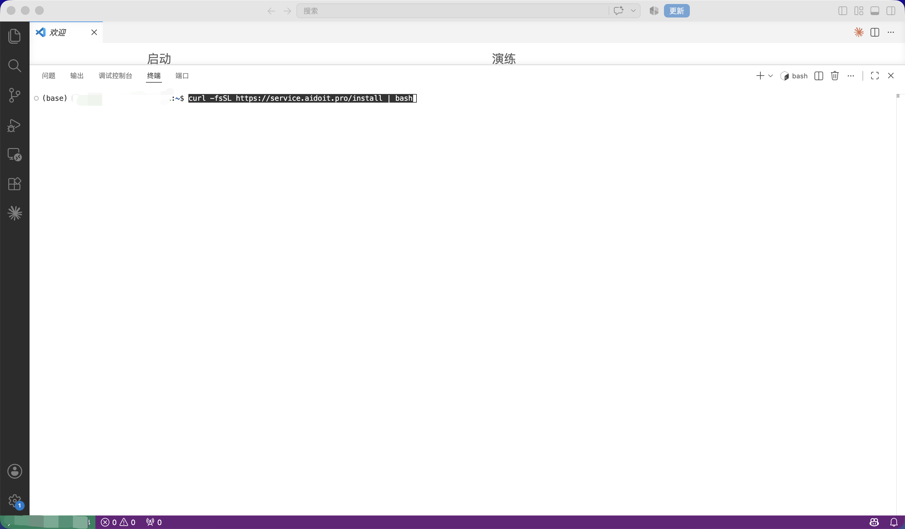
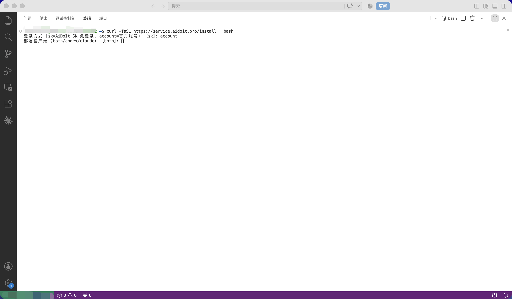
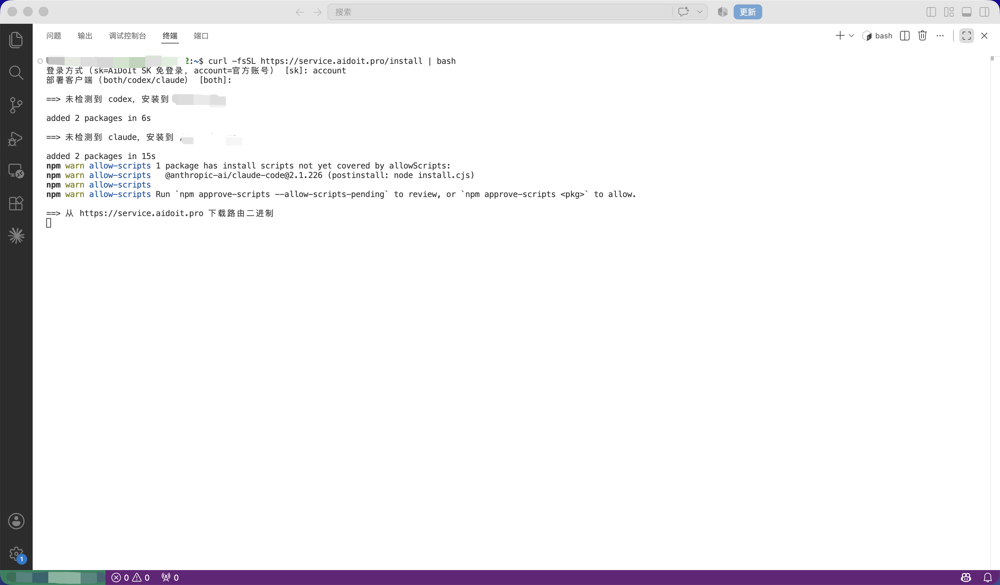
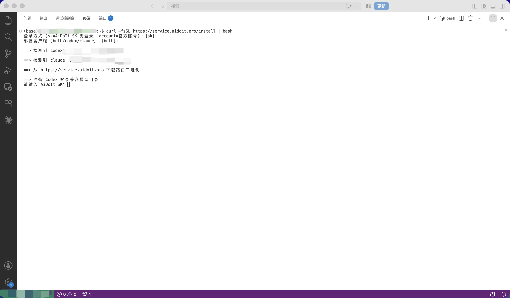
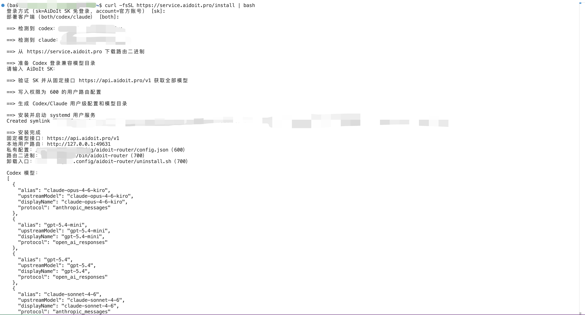
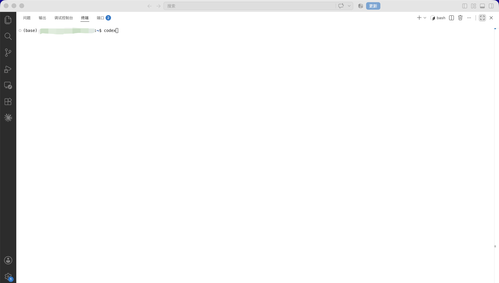
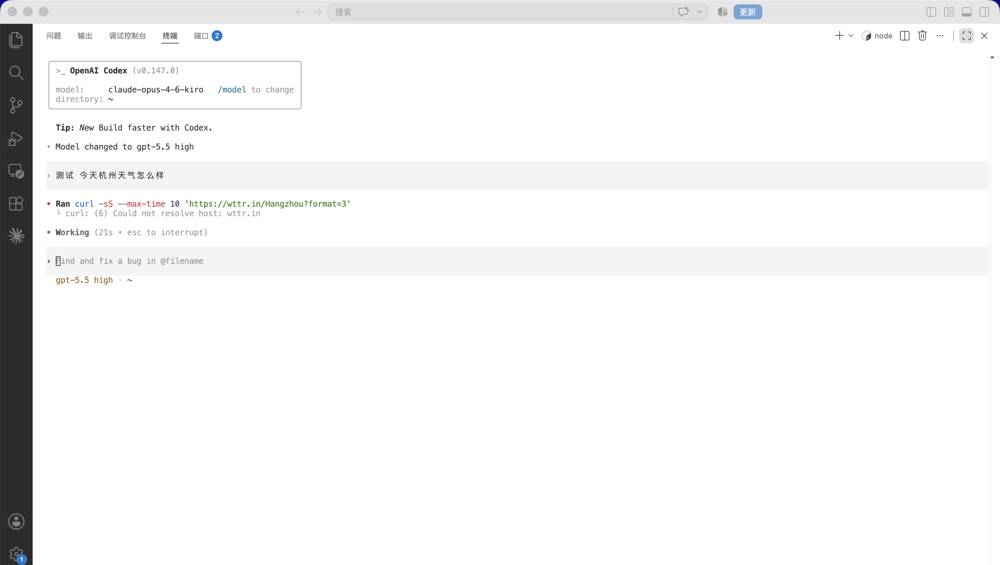
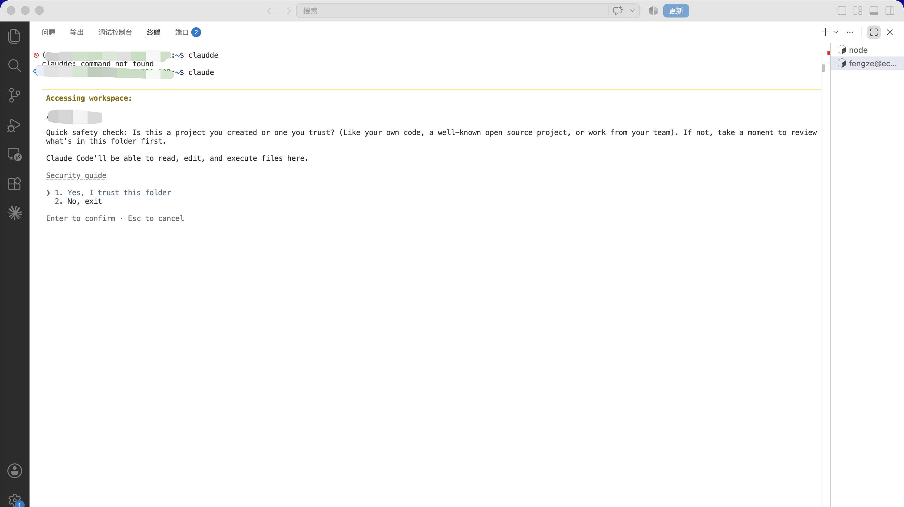
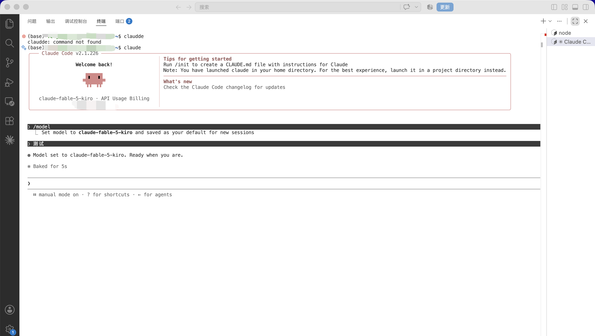

> [AiDoIt 首页](../../README.md) / [帮助中心](../README.md) / Ubuntu

# Ubuntu 下安装和使用 AiDoIt

本文档介绍如何在 **Ubuntu x64 / ARM64** 环境中通过 AiDoIt 安装脚本配置 Codex 和 Claude Code。安装程序会自动检测客户端、配置本地路由、获取可用模型，并生成对应的用户配置。

> [!NOTE]
> Ubuntu 使用独立的在线安装方式，不需要下载 Windows 或 macOS 安装包。可以只部署 Codex、只部署 Claude Code，或同时部署两者。

## 开始前检查

- 使用最终需要运行 `codex` 或 `claude` 的普通 Linux 用户登录。
- 确认服务器可以访问 `service.aidoit.pro` 和所选 Provider。
- 准备 AiDoIt SK，或准备使用客户端官方账号登录。
- 如果脚本需要安装 CLI，请确保 Node.js、npm 及相应的用户级安装权限可用。

安装流程：**运行脚本 → 选择登录方式 → 选择客户端 → 写入用户配置 → 启动并测试模型**。

## 一、运行安装脚本

在 VS Code 中打开 Ubuntu 终端，执行以下命令：

```bash
curl -fsSL https://service.aidoit.pro/install | bash
```



安装程序启动后，需要选择登录方式：

- `sk`：使用 AiDoIt SK 免登录，适合通过 AiDoIt 接口使用模型。
- `account`：使用客户端官方账号登录。

随后选择需要部署的客户端：

- `both`：同时配置 Codex 和 Claude Code，直接按回车时使用该默认选项。
- `codex`：只配置 Codex。
- `claude`：只配置 Claude Code。



## 二、自动安装客户端和路由程序

如果系统中没有安装 Codex 或 Claude Code，脚本会通过 npm 自动安装相应的软件包。之后，脚本会从 AiDoIt 服务下载本地路由程序。



如果系统已经安装客户端，脚本会显示检测到的程序路径并继续配置，无需重复安装。

选择 SK 登录方式后，根据终端提示输入 AiDoIt SK。输入内容属于敏感凭据，操作时不会公开展示，请妥善保存。



## 三、完成路由与模型配置

脚本收到 SK 后会自动完成以下操作：

1. 验证 SK，并通过固定接口获取可用模型列表。
2. 写入仅当前用户可读写的路由配置。
3. 生成 Codex、Claude Code 的用户配置和模型目录。
4. 安装并启动 `systemd` 用户服务。
5. 启动本地路由，并将客户端请求转发到 AiDoIt 模型接口。

终端出现“安装完成”、固定模型接口、本地用户路由以及模型列表等信息，表示配置已经生成。



> 截图中可能包含本机用户名、路径或服务信息，对外分享文档前建议检查并遮盖隐私内容。

## 四、启动并测试 Codex

安装完成后，在终端中运行：

```bash
codex
```



进入 Codex 后，可以使用 `/model` 命令打开模型选择界面。选择需要的模型后输入一条测试指令，确认模型能够正常响应。

下面的示例将模型切换到 GPT 系列模型，并输入天气查询作为连通性测试。截图中的外部天气请求失败属于测试过程中访问第三方网站失败，不代表 AiDoIt 模型接口安装失败。



## 五、启动并测试 Claude Code

在终端中运行以下命令启动 Claude Code：

```bash
claude
```

首次在某个目录中启动时，Claude Code 会询问是否信任当前工作目录。确认目录中的文件安全后，选择：

```text
1. Yes, I trust this folder
```



进入 Claude Code 后，可以通过 `/model` 查看或切换当前模型。输入简单的测试消息，看到模型正常回复即表示配置成功。



## 六、卸载并恢复原配置

使用安装时的同一个 Linux 用户运行：

```bash
curl -fsSL https://service.aidoit.pro/uninstall | bash
```

卸载程序会停止 AiDoIt 用户级路由并尝试恢复首次安装前保存的 Codex 与 Claude Code 用户配置。卸载完成后，请重新打开终端，再分别运行 `codex` 或 `claude` 检查官方登录状态。

> [!IMPORTANT]
> 不要直接删除 AiDoIt 配置目录来代替卸载脚本，否则可能丢失用于恢复的备份信息。

## 七、常见问题

### 安装后找不到 `codex` 或 `claude`

关闭并重新打开终端，让新的 `PATH` 生效。仍找不到时，使用 `command -v codex` 或 `command -v claude` 检查 CLI 是否安装成功。

### 模型列表为空或测试失败

检查服务器网络、AiDoIt SK 或官方账号状态，以及 Provider 服务是否可达。不要把完整 SK、API Key 或配置文件发布到 Issue。

### 重装后仍使用旧配置

先运行卸载脚本恢复原状态，再重新执行安装脚本。请确保安装和卸载使用同一个 Linux 用户。

## 八、安全注意事项

- 安装前请确认 Ubuntu 可以正常联网，并已具备 Node.js、npm 所需的运行环境或安装权限。
- `curl ... | bash` 会直接执行远程脚本；执行前应确认服务地址和脚本来源可信。
- AiDoIt SK 属于敏感信息，不要提交到 Git 仓库，也不要直接展示在截图或日志中。
- Claude Code 能够读取、编辑和执行当前目录中的文件，请只信任自己确认安全的目录。
- 如果安装后提示找不到 `codex` 或 `claude`，可以关闭并重新打开终端，使新的环境变量生效后再次运行。

## 下一步

- [返回帮助中心](../README.md)
- [查看 Windows Codex 教程](../Windows/Codex/README.md)
- [提交问题或建议](https://github.com/AiDoIt-Platform/AiDoIt/issues/new)
