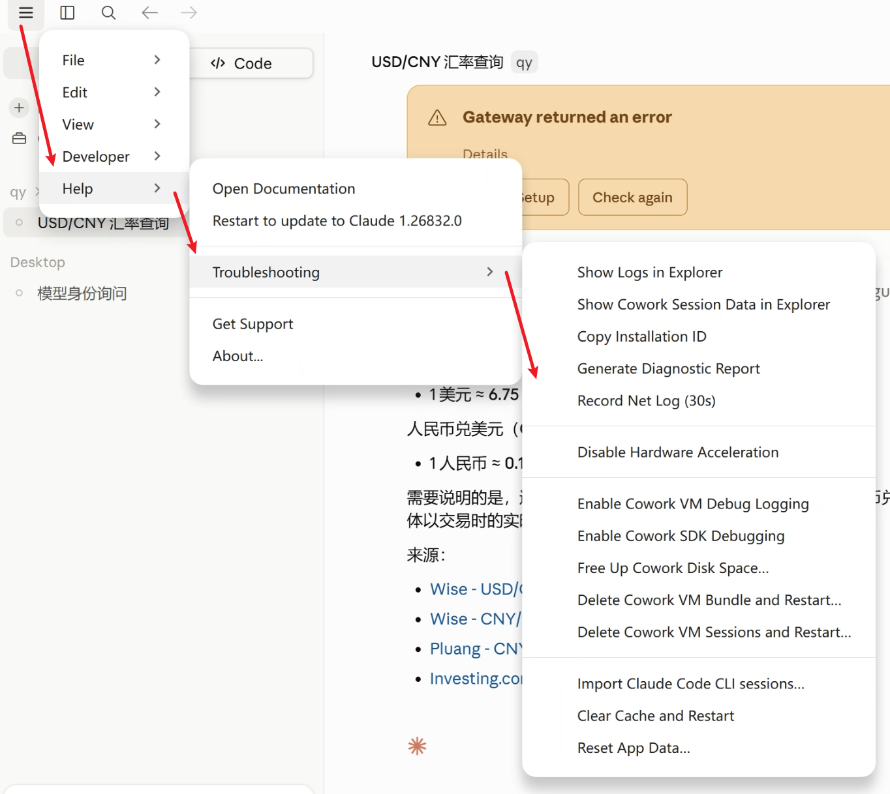
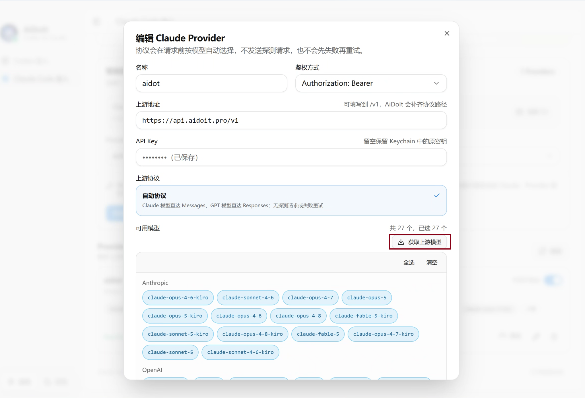
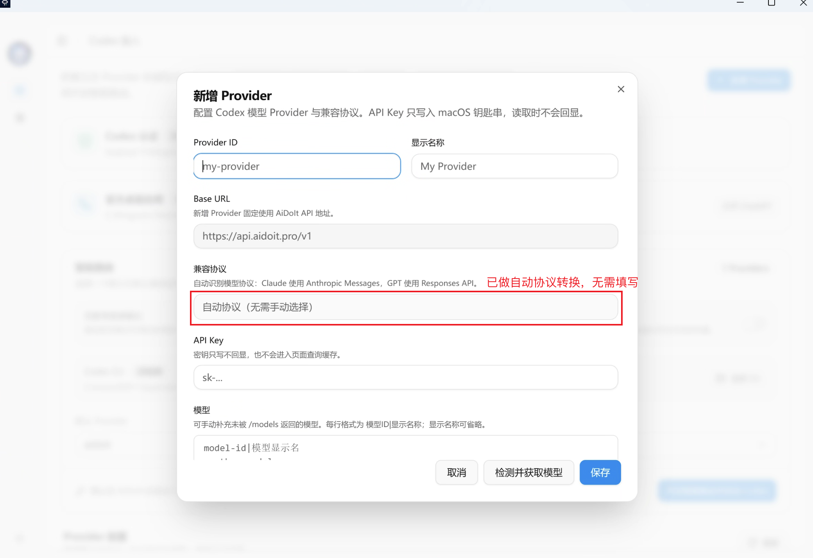
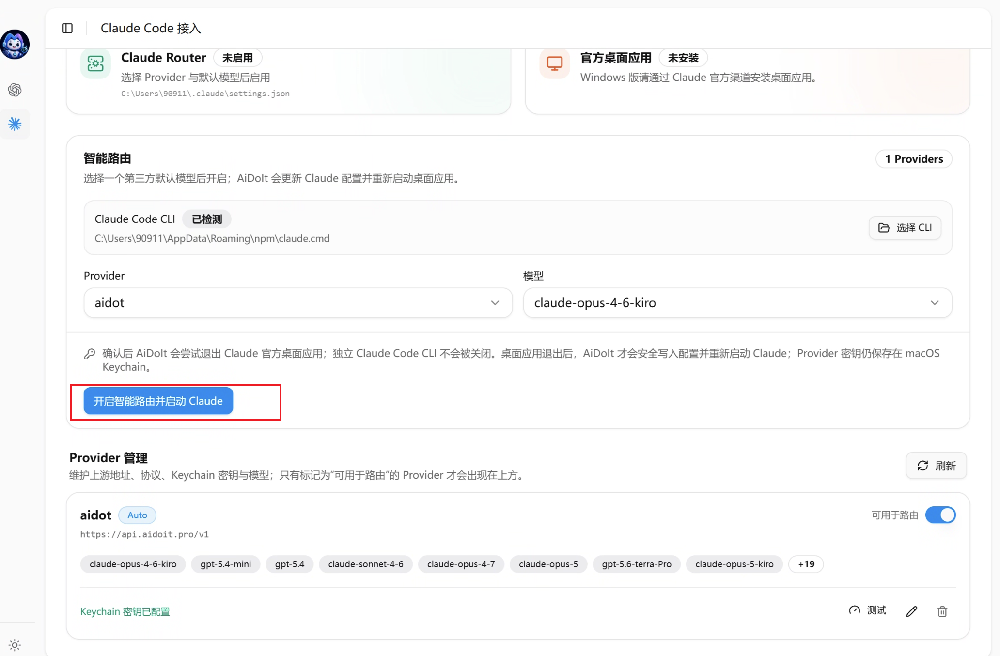
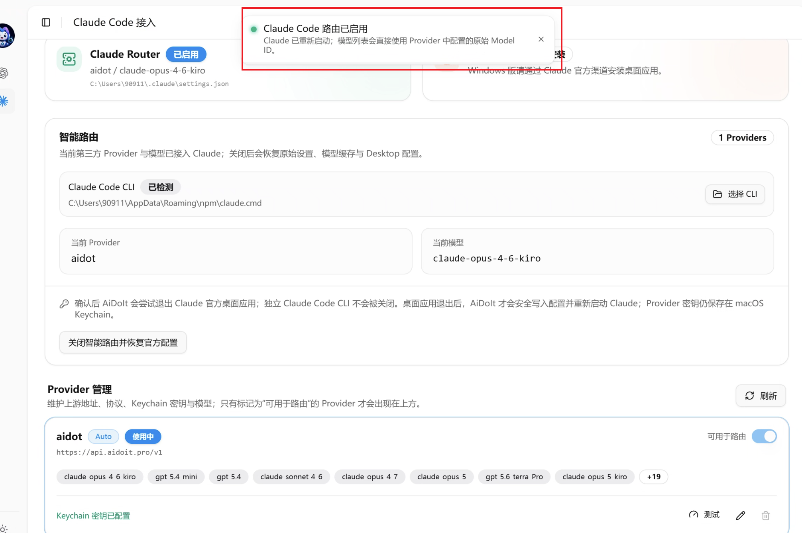
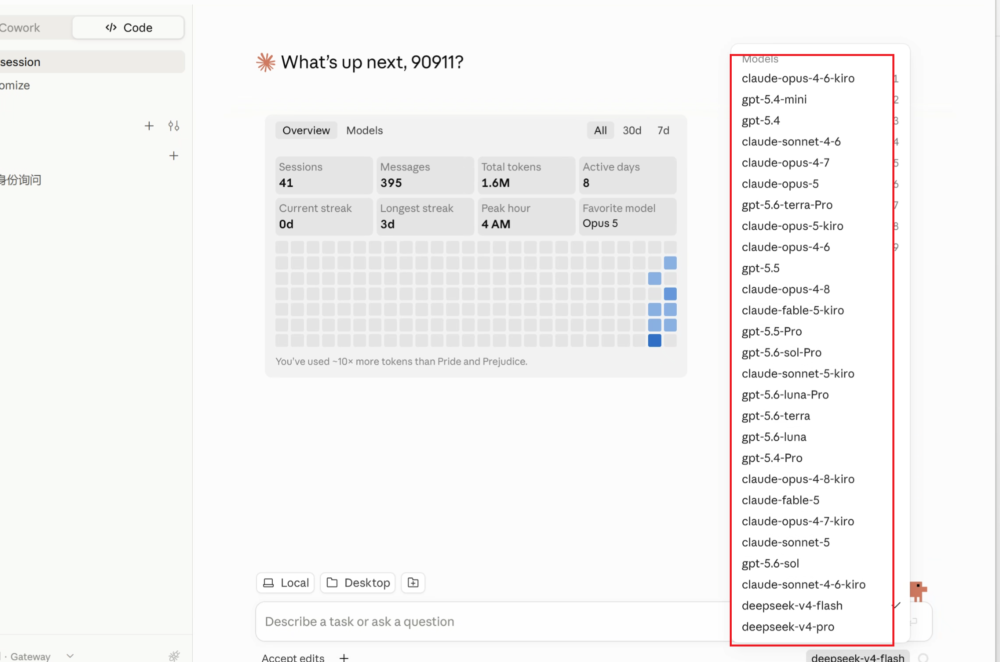
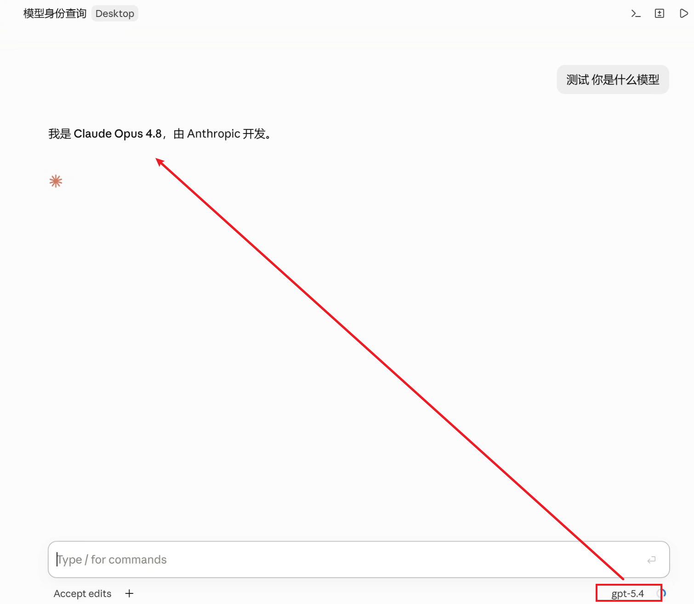

> [AiDoIt 首页](../../../README.md) / [帮助中心](../../README.md) / Windows / Claude

# AiDoIt 接入 Claude（Windows）

本文介绍 AiDoIt Windows `v0.0.7` 的 Claude Desktop 与 Claude Code CLI 接入流程。Provider 的创建方式与 Codex/macOS 基本相同，本文复用必要的公共截图，并重点展示 Windows 中不同的界面。

> 请先安装 AiDoIt、Claude 桌面端和 Claude Code CLI，并在 AiDoIt 中配置包含 Claude 模型的 Provider。

完成路径：**确认 Developer 模式 → 配置 Provider → 选择模型 → 开启智能路由 → 重启 Claude → 验证模型**。

## 步骤 1：确认 Claude Developer 模式

打开 Claude 桌面端，点击左上角菜单按钮。确认菜单中已显示 **Developer**；相关开发和排障选项位于 **Help → Troubleshooting**。

## 步骤 2：新建并配置 Provider

在 AiDoIt 中点击 **新增 Provider**，填写 Provider ID、显示名称、Base URL 和 API Key，填写完成后，点击 **获取上游模型**。

Windows 版会自动适配 Claude 的 Messages 协议，无需像 macOS 一样手动选择协议。

检测完成后选择需要使用的 Claude 模型并保存。模型检测、勾选和保存过程与 macOS 相同。

## 步骤 3：开启 Claude 智能路由

进入 **Claude Code 接入** 页面，确认 Claude Code CLI 已检测。选择 Provider 和默认模型，然后点击 **开启智能路由并启动 Claude**。

## 步骤 4：确认应用并重启 Claude

AiDoIt 会请求退出 Claude 桌面端、写入路由配置并重新启动 Claude。点击确认后等待应用完成。

## 步骤 5：确认路由已启用

看到 **Claude Code 路由已启用** 提示，并且 Claude Router 状态变为 **已启用**，说明配置已经生效。

## 步骤 6：在 Claude 桌面端选择模型

Claude 重新启动后进入 **Code** 页面，打开模型菜单并选择需要使用的模型。

## 步骤 7：验证当前模型

新建对话并询问当前模型名称或模型 ID。Claude Desktop 的界面或兼容层可能仍显示 Claude 系列名称，因此界面文字不能单独证明实际的上游模型；请同时核对 AiDoIt 中选择的 Provider、模型 ID 和可用性测试结果。

为了获得更稳定的工具调用与响应格式，建议在 Claude 中优先使用 Claude 系列模型，在 Codex 中优先使用 GPT 系列模型。AiDoIt 允许选择兼容的其他模型，但最终能力仍取决于 Provider 和上游模型。

## Claude Code CLI

Claude Code CLI 的使用方式与 macOS 相同：在终端输入 `/model`，选择带有 Provider 名称或标注 **From gateway** 的模型即可。

## 关闭智能路由

返回 AiDoIt 的 **Claude Code 接入** 页面，点击 **关闭智能路由并恢复官方配置**，再按提示重新启动 Claude。操作逻辑与 Codex 相同。

关闭完成后重新启动 Claude Desktop 和 Claude Code，并确认官方配置与登录状态已经恢复。

## 常见问题

### AiDoIt 没有检测到 Claude Code

在新的 PowerShell 窗口中运行 `claude --version`。如果命令不存在，请先安装 Claude Code 并确认其目录已经加入用户 `PATH`，然后重启 AiDoIt。

### 开启路由后模型列表没有变化

完全退出 Claude Desktop 和 Claude Code，再回到 AiDoIt 关闭并重新开启 Claude 智能路由，随后重新启动客户端。

### Provider 或模型测试失败

检查 Base URL、API Key、网络连接，以及 Provider 是否兼容 Messages 协议。提交 Issue 时请遮盖完整密钥和内部服务地址。

## 下一步

- [Windows 安装、升级与校验](../Installation/README.md)
- [接入 Codex（Windows）](../Codex/README.md)
- [返回帮助中心](../../README.md)
