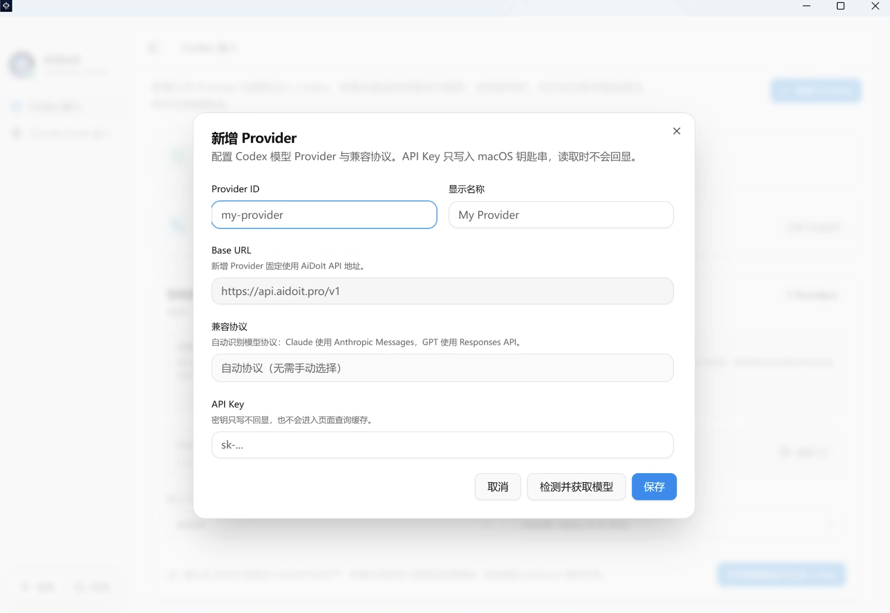
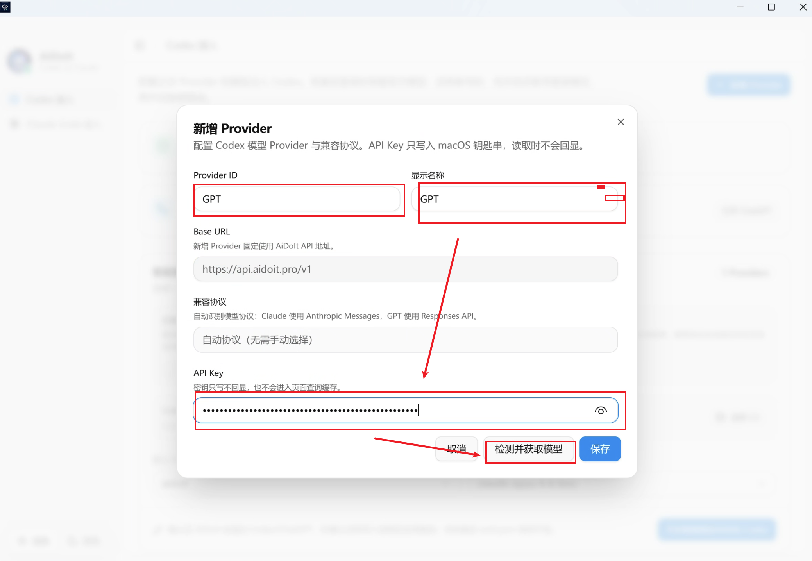
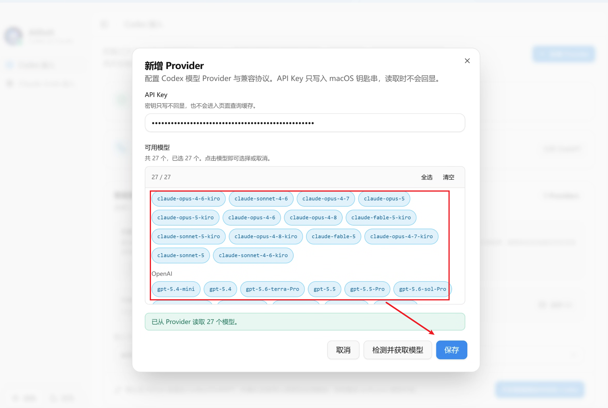
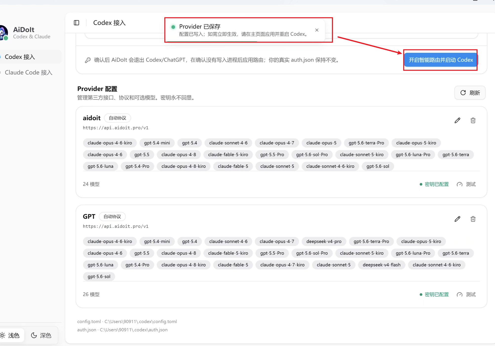
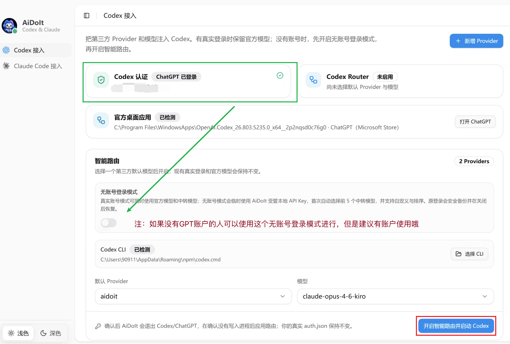
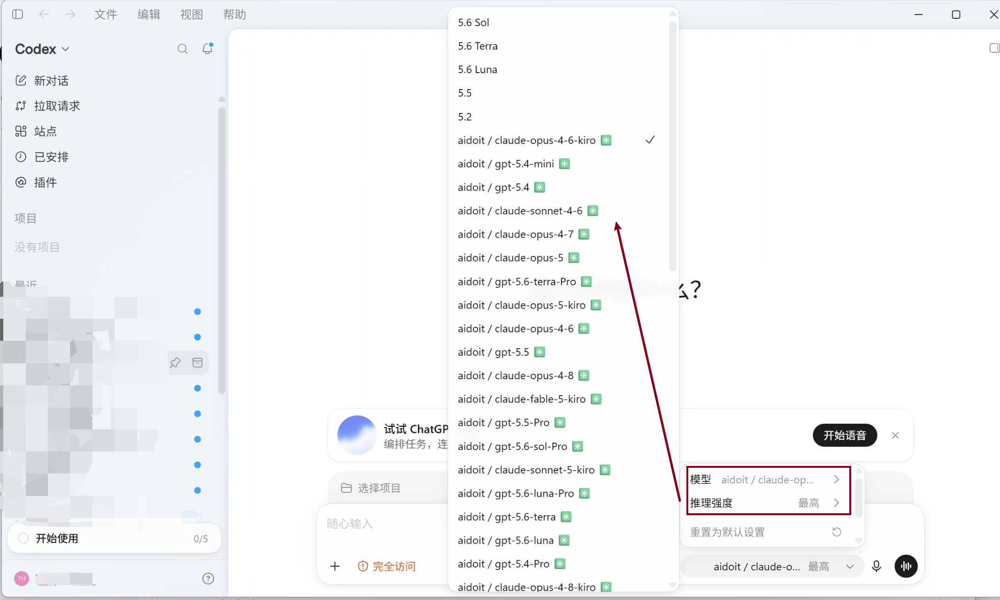
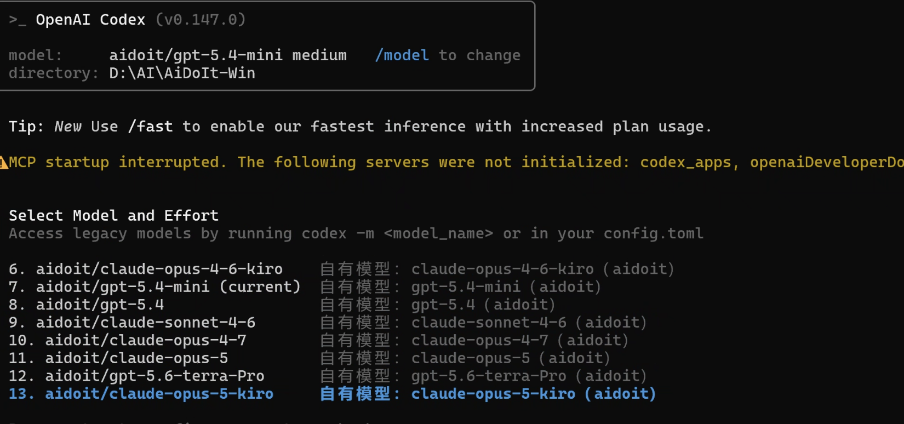

> [AiDoIt 首页](../../../README.md) / [帮助中心](../../README.md) / Windows / Codex

# AiDoIt 接入 Codex（Windows）

本文介绍 AiDoIt Windows `v0.0.7` 的 Codex 接入流程。Provider 的新建、模型检测和保存方式与 macOS 基本相同，因此共用部分 macOS 截图，并重点展示 Windows 中不同的界面。

> 请先安装 AiDoIt、Codex 桌面端和 Codex CLI，并准备好可信的 Base URL 与 API Key。

完成路径：**新增 Provider → 获取并选择模型 → 保存 → 开启智能路由 → 在桌面端或 CLI 选择模型**。

## 步骤 1：新建 Provider

打开 AiDoIt，进入 **Codex 接入** 页面，点击右上角 **新增 Provider**。此步骤与 macOS 相同。

## 步骤 2：填写 Provider 信息

填写 Provider ID、显示名称、Base URL 和 API Key，然后点击 **检测并获取模型**。

Windows 版会自动识别并转换模型协议，**不需要手动选择 Responses API 或 Messages**，这是与 macOS 配置的主要区别。

## 步骤 3：选择模型

检测成功后，勾选需要注入 Codex 的模型。此步骤与 macOS 相同。

## 步骤 4：保存 Provider

确认模型列表无误后，点击右下角 **保存**。

## 步骤 5：开启智能路由

返回 Codex 接入页面，选择默认 Provider 和模型，再点击 **开启智能路由并启动 Codex**。按弹窗提示退出并重新启动 Codex。

### 没有 GPT 账户时使用虚拟账户

如果没有可用的 GPT/Codex 官方账户，可以开启 AiDoIt 提供的虚拟账户模式，再选择需要显示的 Provider 模型。

> Windows 不会出现 macOS 钥匙串授权窗口，因此无需执行 macOS 文档中的钥匙串授权步骤。

## 步骤 6：在 Codex 桌面端选择模型

Codex 重新启动后，打开模型菜单。带有 Provider 名称的模型即为 AiDoIt 注入的模型，选择后即可使用。

## 步骤 7：在 Codex CLI 中选择模型

在 Codex CLI 中输入 `/model`，即可看到 Provider 模型。选择需要的模型并确认，当前模型名称会显示在界面顶部。

## 关闭智能路由

关闭方式与 macOS 相同：返回 AiDoIt 的 Codex 接入页面，点击 **关闭智能路由并恢复登录状态**，再按提示重新启动 Codex。

关闭完成后重新启动 Codex，并确认官方登录状态和官方模型已经恢复。

## 常见问题

### Provider 检测失败

检查 Base URL、API Key、网络连接，以及 Provider 是否可访问。不要在 Issue 或截图中公开完整 API Key。

### 开启路由后没有看到新模型

完全退出 Codex 和 ChatGPT，再回到 AiDoIt 关闭并重新开启 Codex 智能路由。随后重新启动客户端并打开模型菜单。

### Codex CLI 中没有 Provider 模型

在新的 PowerShell 窗口中运行 `codex --version`，确认当前 CLI 可用且与 AiDoIt 检测到的路径一致，再重新开启路由。

## 下一步

- [Windows 安装、升级与校验](../Installation/README.md)
- [接入 Claude（Windows）](../Claude/README.md)
- [返回帮助中心](../../README.md)
