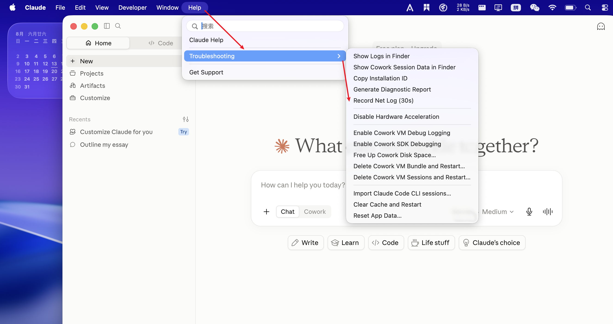
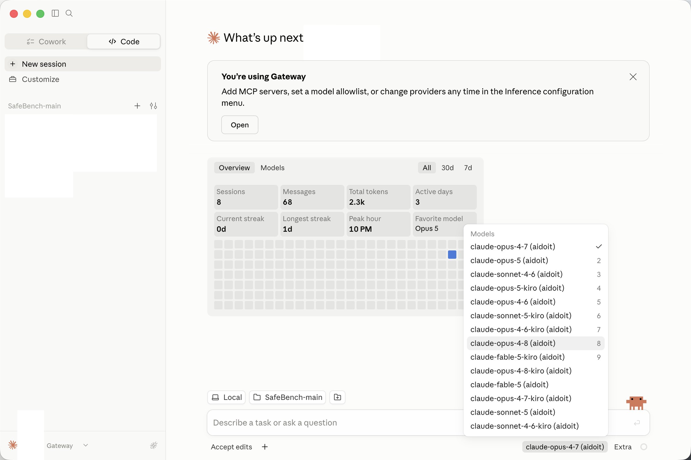
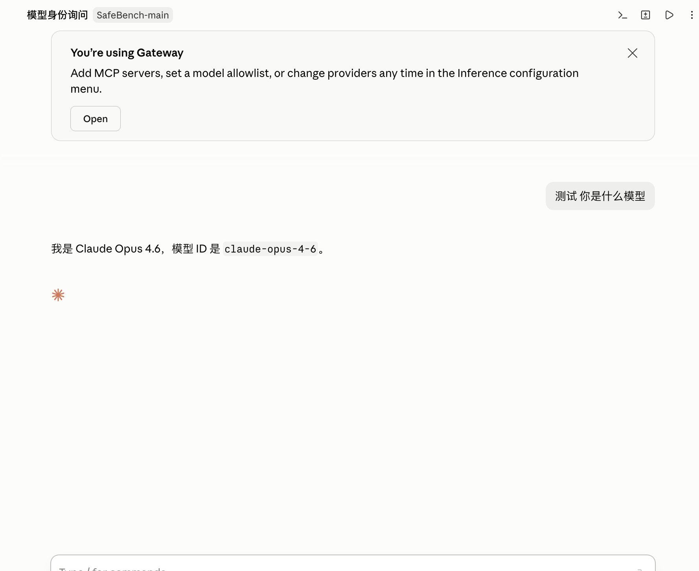
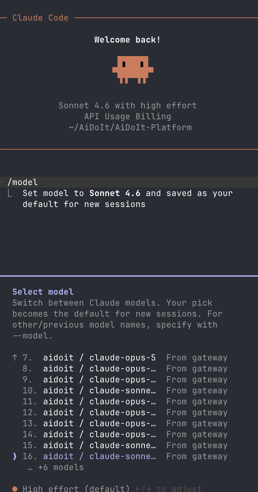
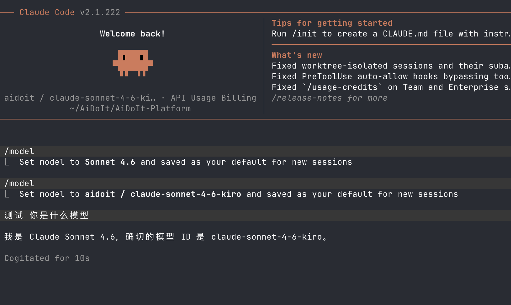

> [AiDoIt 首页](../../../README.md) / [帮助中心](../../README.md) / macOS / Claude

# AiDoIt 接入 Claude（macOS）

本文介绍如何通过 AiDoIt 为 Claude 桌面端和 Claude Code CLI 启用第三方 Provider。

> 开始前，请确保 Claude 桌面端、Claude Code CLI 和需要使用的 Provider 已配置完成。Claude 模型建议使用 **Messages** 兼容协议。

> [!NOTE]
> macOS 与 Windows 使用不同的安装包和发布节奏；Windows `v0.0.7` 安装包不能用于 macOS。请从 [GitHub Releases](https://github.com/AiDoIt-Platform/AiDoIt/releases) 获取适合 Mac 的版本。

完成路径：**开启 Developer 模式 → 选择 Provider 与模型 → 开启路由 → 在桌面端和 CLI 中验证**。

## 步骤 1：开启 Claude Developer 模式

首先打开 Claude 桌面端并开启 **Developer 模式**。开启后，可在顶部菜单栏看到 **Developer** 菜单；相关开发与排障选项可从 **Help → Troubleshooting** 中进入。

## 步骤 2：选择 Provider 并开启智能路由

打开 AiDoIt，进入 **Claude Code 接入** 页面。新建Provider和Codex一致，选择需要使用的 Provider 和默认模型，然后点击 **开启智能路由并启动 Claude**。AiDoIt 会写入配置并重新启动 Claude 桌面端。

## 步骤 3：在 Claude 桌面端选择模型

Claude 重新启动后进入 **Code** 页面，打开模型菜单。列表中带有 Provider 名称的模型即为 AiDoIt 注入的第三方模型，点击即可切换。

## 步骤 4：验证桌面端模型

新建对话并询问当前模型名称或模型 ID。确认回复与所选模型一致，表示 Claude 桌面端路由已生效。

## 步骤 5：在 Claude Code CLI 中选择模型

打开 Claude Code CLI，输入 `/model`。在模型列表中选择带有 Provider 名称且标注 **From gateway** 的模型。

## 步骤 6：验证 Claude Code CLI 模型

选择模型后，可再次输入 `/model` 查看当前配置，或直接询问模型名称与 ID。返回结果与所选 Provider 模型一致即表示配置成功。

## 关闭智能路由

关闭方式与 Codex 相同：返回 AiDoIt 的 **Claude Code 接入** 页面，点击 **关闭智能路由并恢复登录状态**，再按提示退出并重新启动 Claude，即可恢复官方配置。

## 常见问题

### Claude 中没有 Code 或 Developer 入口

确认 Claude Desktop 已更新到支持相关功能的版本，并在应用菜单中检查 **Help → Troubleshooting**。不同版本的菜单位置可能略有变化。

### Provider 模型没有出现

完全退出 Claude Desktop 和 Claude Code，回到 AiDoIt 重新保存 Provider，并关闭后再次开启 Claude 智能路由。

### 模型名称与预期不同

Claude 的界面或兼容层可能保留 Claude 系列显示名称。请同时核对 AiDoIt 中选择的 Provider、模型 ID 和模型测试结果。

## 下一步

- [接入 Codex（macOS）](../Codex/README.md)
- [Ubuntu 安装与使用](../../Ubuntu/README.md)
- [返回帮助中心](../../README.md)
