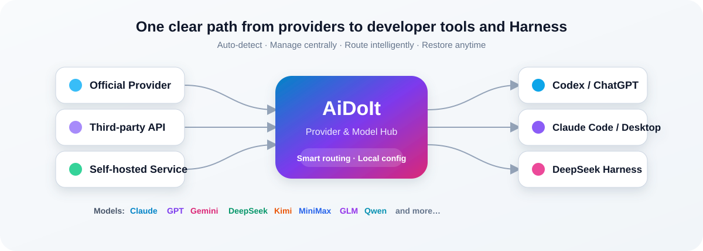

<div align="center">


<br />

[简体中文](README.md) · [English](README.en.md) · [日本語](README.ja.md) · [한국어](README.ko.md) · [Deutsch](README.de.md) · [العربية](README.ar.md) · [Español](README.es.md)

<br />

[](https://github.com/AiDoIt-Platform/AiDoIt/releases/latest)
[](https://github.com/AiDoIt-Platform/AiDoIt/releases/latest)
[](HelpMd/Ubuntu/README.md)
[](#-security-and-privacy)
[](LICENSE)

### One app for your AI coding tools and models

AiDoIt supports **Windows desktop and Ubuntu x64 / ARM64**. Manage **Codex, ChatGPT, Claude Code, Claude Desktop, and DeepSeek Harness** on Windows, deploy Codex and Claude Code on Ubuntu servers, and switch freely between official accounts and third-party provider models.

[Download now](https://github.com/AiDoIt-Platform/AiDoIt/releases/latest) · [Quick start](#-quick-start) · [Visual guides](#-documentation) · [Report an issue](https://github.com/AiDoIt-Platform/AiDoIt/issues/new)

</div>

---

## ✨ Why AiDoIt

| Capability | What you get |
|---|---|
| **Windows + Ubuntu** | Cover Windows 10/11 desktops and Ubuntu x64 / ARM64 command-line environments |
| **One control center** | Manage Codex, Claude, and DeepSeek Harness without repeatedly editing configuration files |
| **Automatic detection** | Discover installed desktop apps, CLIs, sign-in state, and local runtimes |
| **Multiple providers and models** | Keep providers, credentials, and model catalogs separate and switch defaults at any time |
| **Test before enabling** | Measure real availability and response time before applying a model |
| **Isolated configuration** | Manage Codex, Claude, and Harness independently so their settings do not interfere |
| **Safe restoration** | Preserve the original state before routing and restore official settings when routing is disabled |
| **In-app updates** | Starting with `v0.0.7`, discover and install later stable releases from inside the app |
| **Local secrets** | Keep provider API keys on your device and never display the full value in the UI |

<br />



## 📦 Download and install

### Windows 10/11 x64

The current stable Windows release is **AiDoIt v0.0.9**. Download only from [GitHub Releases](https://github.com/AiDoIt-Platform/AiDoIt/releases/latest).

| Package | Recommended use | Download |
|---|---|---|
| `AiDoIt_0.0.9_x64-setup.exe` | Standard installer recommended for most users | [Download Setup EXE](https://github.com/AiDoIt-Platform/AiDoIt/releases/download/v0.0.9/AiDoIt_0.0.9_x64-setup.exe) |

> [!TIP]
> For checksum verification, upgrades, and silent MSI installation, see the [Windows installation guide](HelpMd/Windows/Installation/README.md).

### macOS (Apple Silicon)

[Download AiDoIt v0.0.9 DMG](https://github.com/AiDoIt-Platform/AiDoIt/releases/download/v0.0.9/AiDoIt_0.0.9_aarch64.dmg)

Drag AiDoIt into Applications.

This build is ad-hoc signed and is not notarized by Apple. On first launch, you may need to right-click and choose Open.

### Ubuntu x64 / ARM64

Install on an Ubuntu server with the online script, choosing Codex, Claude Code, or both:

```bash
curl -fsSL https://service.aidoit.pro/install | bash
```

Uninstall online and restore the user configuration saved before installation:

```bash
curl -fsSL https://service.aidoit.pro/uninstall | bash
```

> [!IMPORTANT]
> `curl | bash` executes a remote script directly. Verify the domain and source first, then follow the complete [Ubuntu visual guide](HelpMd/Ubuntu/README.md).

## 🚀 Quick start

### Windows

1. Install and launch AiDoIt, then let it detect your local tools and sign-in state.
2. Open **Codex Integration**, **Claude Code Integration**, or **DeepSeek Harness**.
3. Add a provider and enter a trusted Base URL and API key.
4. Fetch or add models, then run an availability test first.
5. Select the default provider and model, then enable the integration.
6. Disable third-party integration whenever needed to restore the previous official configuration.

### Ubuntu

1. Sign in as the regular Linux user who will run Codex or Claude Code.
2. Run the installation command above and choose `sk` or `account` sign-in.
3. Select `both`, `codex`, or `claude` as the deployment target.
4. Run `codex` or `claude`, then use `/model` to select and test a model.

| I want to… | Start here |
|---|---|
| Use provider models in Codex or ChatGPT | [Codex on Windows](HelpMd/Windows/Codex/README.md) |
| Use provider models in Claude Code or Claude Desktop | [Claude on Windows](HelpMd/Windows/Claude/README.md) |
| Configure Codex or Claude Code on Ubuntu | [Ubuntu installation and usage](HelpMd/Ubuntu/README.md) |

## 🧩 Core features

<details open>
<summary><strong>Codex and ChatGPT integration</strong></summary>

- Detect Codex, ChatGPT, Codex CLI, and the current sign-in state automatically.
- Use official and third-party provider models side by side.
- Install, select, and launch Codex, with real model tests before activation.
- When an app is busy, choose a normal exit or a forced close before continuing.

</details>

<details>
<summary><strong>Claude Code and Claude Desktop integration</strong></summary>

- Detect, install, and launch Claude Code automatically.
- Detect and open Claude Desktop, or select a local installer manually.
- Keep Claude providers, models, and credentials separate from Codex settings.
- Restore the previous settings and model configuration when integration is disabled.

</details>

<details>
<summary><strong>DeepSeek Harness management</strong></summary>

- Install, start, stop, and open DeepSeek Harness Web.
- Manage its providers, credentials, models, and default model independently.
- Display model context and reasoning capabilities and run real response tests.
- Leave existing Harness agents, tools, sessions, and task history untouched.
- Protect active configuration while Harness is running, then unlock it after shutdown.

</details>

<details>
<summary><strong>Provider and model management</strong></summary>

- Add multiple providers with separate endpoints, keys, models, and enabled states.
- Fetch upstream models automatically or maintain the list manually.
- Select favorites and defaults without repeatedly entering credentials.
- Switch the interface instantly between Chinese and English; AiDoIt remembers the choice.

</details>

## 📚 Documentation

| Platform | Guides |
|---|---|
| Windows | [Install and upgrade](HelpMd/Windows/Installation/README.md) · [Codex](HelpMd/Windows/Codex/README.md) · [Claude](HelpMd/Windows/Claude/README.md) |
| macOS | [Codex](HelpMd/macOS/Codex/README.md) · [Claude](HelpMd/macOS/Claude/README.md) |
| Ubuntu | [Install, configure, and test](HelpMd/Ubuntu/README.md) |

You can also browse the [AiDoIt Help Center](HelpMd/README.md) by platform.

## 🔐 Security and privacy

- Provider API keys and related settings stay on your device; full keys are never shown in the UI.
- Codex, Claude, and Harness credentials and configuration remain isolated.
- AiDoIt saves the original state before enabling an integration and can restore official settings later.
- Redact API keys, usernames, local paths, and service endpoints before sharing issues, logs, or screenshots.

> [!IMPORTANT]
> AiDoIt manages local configuration and routing. Requests sent to third-party providers remain subject to their privacy policies, pricing, and terms. Use only providers you trust.

## ❓ FAQ

<details>
<summary><strong>Will AiDoIt overwrite my official configuration?</strong></summary>

AiDoIt preserves the original state when an integration is enabled and can restore official settings when it is disabled. Codex, Claude, and Harness are managed independently.

</details>

<details>
<summary><strong>Why does model detection or testing fail?</strong></summary>

Check the Base URL, API key, network connection, and whether the provider supports the protocol required by the target client. Never post a complete key publicly.

</details>

<details>
<summary><strong>Can I configure multiple providers?</strong></summary>

Yes. Each provider can have its own endpoint, key, model catalog, and enabled state, and you can switch at any time.

</details>

## 💬 Contact and feedback

- Project: [AiDoIt-Platform/AiDoIt](https://github.com/AiDoIt-Platform/AiDoIt)
- Issues and ideas: [Open an issue](https://github.com/AiDoIt-Platform/AiDoIt/issues/new)
- Previous releases: [GitHub Releases](https://github.com/AiDoIt-Platform/AiDoIt/releases)
- License: [GNU GPL v3](LICENSE)

<div align="center">

**AiDoIt — Bring every model into your AI development workflow with less friction.**

</div>
