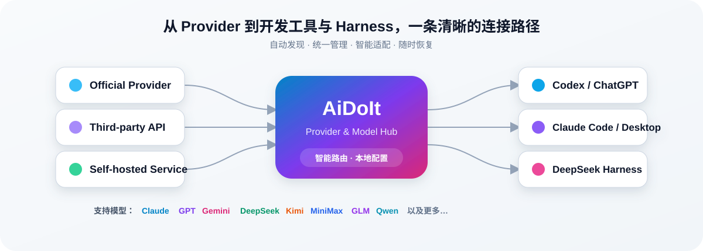

<div align="center">


<br />

[简体中文](README.md) · [English](README.en.md) · [日本語](README.ja.md) · [한국어](README.ko.md) · [Deutsch](README.de.md) · [العربية](README.ar.md) · [Español](README.es.md)

<br />

[](https://github.com/AiDoIt-Platform/AiDoIt/releases/latest)
[](https://github.com/AiDoIt-Platform/AiDoIt/releases/latest)
[](HelpMd/Ubuntu/README.md)
[](#-安全与隐私)
[](LICENSE)

### 一个应用，管理你的 AI 编程工具与模型

AiDoIt 同时支持 **Windows、macOS 桌面端与 Ubuntu x64 / ARM64**：在桌面端集中管理 **Codex、ChatGPT、Claude Code、Claude Desktop 与 DeepSeek Harness**，在 Ubuntu 服务器上快速部署 Codex 与 Claude Code，并在官方账号和第三方 Provider 模型之间自由切换。

[立即下载](https://github.com/AiDoIt-Platform/AiDoIt/releases/latest) · [快速开始](#-快速开始) · [图文教程](#-帮助文档) · [问题反馈](https://github.com/AiDoIt-Platform/AiDoIt/issues/new)

</div>

---

## ✨ 为什么选择 AiDoIt

| 能力 | 你能获得什么 |
|---|---|
| **Windows + macOS + Ubuntu** | 覆盖 Windows 10/11、macOS Apple Silicon 桌面端与 Ubuntu x64 / ARM64 CLI 环境 |
| **统一控制台** | 在一个界面中管理 Codex、Claude 与 DeepSeek Harness，不再反复修改配置文件 |
| **自动检测** | 识别已安装的桌面端、CLI、登录状态与运行环境 |
| **多 Provider / 多模型** | 独立保存 Provider、凭据和模型目录，并随时切换默认模型 |
| **启用前实测** | 获取模型后先测试真实响应速度与可用性，减少无效配置 |
| **配置互不干扰** | Codex、Claude 与 Harness 分区管理，各自拥有独立配置 |
| **一键恢复** | 开启接入前保留原始状态，关闭后恢复官方配置 |
| **应用内更新** | 从 `v0.0.7` 开始可在应用内发现并安装后续正式版本 |
| **密钥本地保存** | Provider API Key 保留在本机，界面不会完整展示 |

<br />



## 📦 下载与安装

### Windows 10/11 x64

当前 Windows 最新正式版为 **AiDoIt v0.0.9**。请只从 [GitHub Releases](https://github.com/AiDoIt-Platform/AiDoIt/releases/latest) 下载。

| 安装包 | 适用场景 | 下载 |
|---|---|---|
| `AiDoIt_0.0.9_x64-setup.exe` | 标准安装程序，推荐大多数用户使用 | [下载 Setup EXE](https://github.com/AiDoIt-Platform/AiDoIt/releases/download/v0.0.9/AiDoIt_0.0.9_x64-setup.exe) |

> [!TIP]
> 需要校验文件、覆盖升级或卸载说明？请查看 [Windows 安装、升级、校验与卸载](HelpMd/Windows/Installation/README.md)。

### macOS（Apple Silicon）

[下载 AiDoIt v0.0.9 DMG](https://github.com/AiDoIt-Platform/AiDoIt/releases/download/v0.0.9/AiDoIt_0.0.9_aarch64.dmg)

打开后将 AiDoIt 拖入 Applications。

此构建使用 ad-hoc 签名，未做 Apple 公证；首次打开时可能需要右键选择打开。

### Ubuntu x64 / ARM64

Ubuntu 服务器通过在线脚本安装，可选择部署 Codex、Claude Code 或同时部署两者：

```bash
curl -fsSL https://service.aidoit.pro/install | bash
```

不再使用时可在线卸载，并恢复安装前保存的用户配置：

```bash
curl -fsSL https://service.aidoit.pro/uninstall | bash
```

> [!IMPORTANT]
> `curl | bash` 会直接执行远程脚本。运行前请确认域名和脚本来源可信；完整流程请阅读 [Ubuntu 图文教程](HelpMd/Ubuntu/README.md)。

## 🚀 快速开始

### Windows 与 macOS

1. 安装并启动 AiDoIt，等待应用检测本机工具与登录状态。
2. 进入 **Codex 接入**、**Claude Code 接入** 或 **DeepSeek Harness** 页面。
3. 新建 Provider，填写可信的 Base URL 与 API Key。
4. 获取或手动添加模型，并先运行可用性测试。
5. 选择默认 Provider 和模型，然后开启对应接入。
6. 不再使用第三方接入时将其关闭，即可恢复启用前的官方配置。

### Ubuntu

1. 使用需要运行 Codex 或 Claude Code 的普通用户登录服务器。
2. 运行上方安装命令，选择 `sk` 或 `account` 登录方式。
3. 选择 `both`、`codex` 或 `claude` 部署目标。
4. 安装完成后运行 `codex` 或 `claude`，再通过 `/model` 选择并测试模型。

| 我想要…… | 从这里开始 |
|---|---|
| 在 Codex / ChatGPT 中使用 Provider 模型 | [Windows Codex 图文教程](HelpMd/Windows/Codex/README.md) |
| 在 Claude Code / Claude Desktop 中使用 Provider 模型 | [Windows Claude 图文教程](HelpMd/Windows/Claude/README.md) |
| 在 Ubuntu 上配置 Codex 或 Claude Code | [Ubuntu 安装与使用教程](HelpMd/Ubuntu/README.md) |

## 🧩 核心功能

<details open>
<summary><strong>Codex 与 ChatGPT 接入</strong></summary>

- 自动检测 Codex、ChatGPT、Codex CLI 与当前登录状态。
- 支持官方模型与第三方 Provider 模型同时使用。
- 可安装、选择和启动 Codex，并在启用前测试模型。
- 遇到应用占用时，由用户选择正常退出或强制关闭后继续。

</details>

<details>
<summary><strong>Claude Code 与 Claude Desktop 接入</strong></summary>

- 自动检测、安装并启动 Claude Code。
- 自动检测和打开 Claude Desktop，也可手动选择本地安装包。
- 使用独立的 Provider、模型与凭据配置，不与 Codex 混用。
- 关闭接入后恢复原有设置和模型配置。

</details>

<details>
<summary><strong>DeepSeek Harness 管理</strong></summary>

- 管理 DeepSeek Harness Web 的安装、启动、停止和打开。
- 独立维护 Provider、模型、凭据和默认模型。
- 展示模型上下文与推理能力，并支持真实响应测试。
- 不接管 Harness 原有 Agent、工具、会话和任务记录。
- Harness 运行时保护正在使用的配置，停止后可继续编辑。

</details>

<details>
<summary><strong>Provider 与模型管理</strong></summary>

- 添加多个 Provider，分别维护服务地址、密钥、模型和启用状态。
- 自动获取上游模型，也可手动增删模型。
- 选择常用模型并设置默认值，切换时无需反复填写凭据。
- 中文与 English 界面可即时切换，并自动记住语言选择。

</details>

## 📚 帮助文档

| 平台 | 教程 |
|---|---|
| Windows | [安装与升级](HelpMd/Windows/Installation/README.md) · [Codex 接入](HelpMd/Windows/Codex/README.md) · [Claude 接入](HelpMd/Windows/Claude/README.md) |
| macOS | [Codex 接入](HelpMd/macOS/Codex/README.md) · [Claude 接入](HelpMd/macOS/Claude/README.md) |
| Ubuntu | [安装、配置与测试](HelpMd/Ubuntu/README.md) |

也可以直接进入 [AiDoIt 帮助中心](HelpMd/README.md) 按平台查找。

## 🔐 安全与隐私

- Provider API Key 与相关配置仅保存在本机，界面不会完整显示密钥。
- Codex、Claude 和 Harness 的凭据与配置相互隔离。
- 启用接入前会保存原始状态，关闭后可恢复官方配置。
- 提交 Issue、日志或截图前，请遮盖 API Key、用户名、本机路径和服务地址。

> [!IMPORTANT]
> AiDoIt 负责本地配置与路由管理。发送到第三方 Provider 的请求仍受其隐私政策、计费规则和服务条款约束，请只使用你信任的服务。

## ❓ 常见问题

<details>
<summary><strong>AiDoIt 会覆盖我的官方配置吗？</strong></summary>

开启接入时会保存原始状态；关闭接入后可恢复官方配置。Codex、Claude 与 Harness 分区管理。

</details>

<details>
<summary><strong>为什么模型检测或测试失败？</strong></summary>

请检查 Base URL、API Key、网络连接，以及 Provider 是否支持目标客户端需要的协议。不要在公开信息中贴出完整密钥。

</details>

<details>
<summary><strong>可以配置多个 Provider 吗？</strong></summary>

可以。每个 Provider 都可独立维护服务地址、密钥、模型和启用状态，并可随时切换。

</details>

## 💬 联系与反馈

- 项目主页：[AiDoIt-Platform/AiDoIt](https://github.com/AiDoIt-Platform/AiDoIt)
- 问题与建议：[提交 Issue](https://github.com/AiDoIt-Platform/AiDoIt/issues/new)
- 历史版本：[GitHub Releases](https://github.com/AiDoIt-Platform/AiDoIt/releases)
- 开源许可：[GNU GPL v3](LICENSE)

<div align="center">

**AiDoIt — 让每一种模型，更轻松地进入你的 AI 开发工作流。**

</div>
